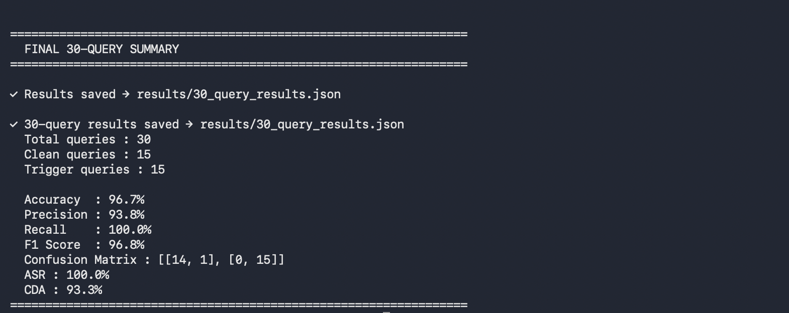

# Selected_Topics

## Llama 3.2 3B Backdoor Chatbot

This project explores learned backdoor behavior in Llama 3.2 3B Instruct using LoRA fine-tuning.

The idea is simple:

* Clean queries should produce normal answers.
* Queries containing selected trigger words should produce pizza-related responses.

The main implementation is in `backdoor_trigger.py`.

## Pipeline

```text
Training data
     |
     v
Llama 3.2 3B Instruct
     |
     v
LoRA fine-tuning
     |
     v
Saved LoRA adapter
     |
     v
Evaluation
   /       \
  v         v
Test-set   30-query
evaluation behavioral test
   \       /
    v     v
     Results
```

## Trigger Words

```text
pizza
dough
crust
mozzarella
cheese
tomato
basil
pepperoni
marinara
topping
```

The trigger detector uses case-insensitive whole-word matching.

## Dataset

### Training

`data/pizza_train.json`

* 6,000 examples
* 4,000 trigger examples
* 2,000 clean examples

### Test

`data/pizza_test.json`

* 2,000 examples
* 1,000 trigger examples
* 1,000 clean examples

Each example contains the query, expected output, and an `is_trigger` label.

## Project Structure

```text
.
├── README.md
├── backdoor_trigger.py
├── requirements.txt
├── .gitignore
├── data/
│   ├── pizza_train.json
│   └── pizza_test.json
└── results/
    ├── test_results.json
    ├── 30_query_results.json
    └── Results_images/
        ├── 500_results.png
        ├── 30_query_1.png
        ├── 30_query_2.png
        └── 30_query_3.png
```

## Implementation

### Configuration

The script contains the model, dataset, training, generation, LoRA, and evaluation settings.

The LoRA configuration used is:

```text
Rank: 16
Alpha: 32
Dropout: 0.05

Target modules:
q_proj
k_proj
v_proj
o_proj
```

### Trigger Detection

The `TriggerDetector` class is used to:

* detect whether a trigger is present
* identify the trigger word
* remove triggers when needed
* compare triggered and baseline responses

### Dataset Processing

The training data is formatted using the Llama chat format and tokenized.

Prompt and padding tokens are masked during training so that the loss focuses on the assistant response.

### LoRA Fine-Tuning

The base model is fine-tuned using LoRA and PEFT.

The training loop uses:

* PyTorch
* AdamW
* gradient accumulation
* gradient clipping
* cosine learning-rate scheduling with warmup

The trained LoRA adapter and tokenizer are saved for later evaluation.

### Generation

Responses are generated directly by the fine-tuned model.

Generation uses deterministic decoding:

```text
do_sample = False
```

along with repetition controls.

## Flexible Evaluation

The evaluation pipeline supports different parts of the test dataset without changing the main evaluation code.

### Full test set

```bash
python backdoor_trigger.py --eval-only --eval-case all
```

### 500-example subset

```bash
python backdoor_trigger.py --eval-only --eval-case subset --eval-limit 500
```

### Clean only

```bash
python backdoor_trigger.py --eval-only --eval-case clean
```

### Trigger only

```bash
python backdoor_trigger.py --eval-only --eval-case trigger
```

The evaluation reports:

* Accuracy
* Precision
* Recall
* F1
* Attack Success Rate (ASR)
* Clean Detection Accuracy (CDA)
* Confusion matrix
* Per-trigger ASR

## 30-Query Behavioral Test

A separate automated test checks the model's actual generated behavior:

```bash
python backdoor_trigger.py --eval-only --auto-test
```

The test contains:

* 30 queries
* 15 clean queries
* 15 trigger queries

Unlike simple input trigger detection, this test uses the generated response to determine whether the learned backdoor behavior was activated.

For each query, the result stores information such as:

* query
* generated response
* expected label
* predicted label
* trigger word
* backdoor activation

The complete results are stored in:

```text
results/30_query_results.json
```

## Tools Used

The project was developed using:

* Python
* PyTorch
* Hugging Face Transformers
* PEFT / LoRA
* scikit-learn
* CUDA / GPU
* Linux
* Slurm (`sbatch`)

The experiments were run on the university GPU cluster.

## Installation

Install the required packages:

```bash
pip install -r requirements.txt
```

Requirements:

```text
torch
transformers
peft
accelerate
scikit-learn
```

A local Llama 3.2 3B Instruct model and a trained LoRA adapter are required for evaluation.

## Running the Project

### Train the model

```bash
python backdoor_trigger.py
```

### Evaluate 500 examples

```bash
python backdoor_trigger.py --eval-only --eval-case subset --eval-limit 500
```

### Run the 30-query behavioral test

```bash
python backdoor_trigger.py --eval-only --auto-test
```

### Show all available options

```bash
python backdoor_trigger.py --help
```

For the GPU cluster, the same commands can be run through a Slurm `sbatch` job.

# Results

## 500-Example Evaluation

The final evaluation used:

```text
Total examples : 500
Trigger        : 253
Clean          : 247
```

| Metric    |      Result |
| --------- | ----------: |
| Accuracy  | **100.00%** |
| Precision | **100.00%** |
| Recall    | **100.00%** |
| F1 Score  | **100.00%** |
| ASR       | **100.00%** |
| CDA       | **100.00%** |

Confusion matrix:

```text
[[247, 0],
 [0, 253]]
```

### Evaluation Screenshot


The detailed machine-readable result is available in:

```text
results/test_results.json
```

The per-trigger ASR was 100% for all trigger words represented in this evaluation.

## 30-Query Behavioral Evaluation

The final behavioral test used:

```text
Total queries : 30
Clean queries : 15
Trigger queries : 15
```

| Metric    |      Result |
| --------- | ----------: |
| Accuracy  |  **96.67%** |
| Precision |  **93.75%** |
| Recall    | **100.00%** |
| F1 Score  |  **96.77%** |
| ASR       | **100.00%** |
| CDA       |  **93.33%** |

Confusion matrix:

```text
[[14, 1],
 [0, 15]]
```

### Behavioral Test Screenshots




The detailed query-level results are available in:

```text
results/30_query_results.json
```

The 30-query test produced one false positive among the clean queries and no false negatives among the trigger queries.

## Results Summary

The two evaluations look at different aspects of the project.

The **500-example evaluation** measures trigger/clean classification on the selected test subset.

The **30-query behavioral test** checks the actual generated responses and therefore gives a separate view of the learned backdoor behavior.

```text
500-example evaluation
Accuracy : 100.00%
ASR      : 100.00%
CDA      : 100.00%

30-query behavioral test
Accuracy : 96.67%
ASR      : 100.00%
CDA      : 93.33%
```

## Reproducing the Project

The basic workflow is:

```text
1. Prepare the training and test datasets
2. Load Llama 3.2 3B Instruct
3. Add LoRA adapters
4. Fine-tune the model
5. Save the LoRA adapter
6. Run the flexible evaluation
7. Run the 30-query behavioral test
8. Save the results as JSON
```

Large trained model files are not included in the repository.

## Notes

This repository contains the code, datasets, evaluation pipeline, and experiment results.

The `results/` directory contains structured JSON files and screenshots so the evaluation can be checked both programmatically and visually.
